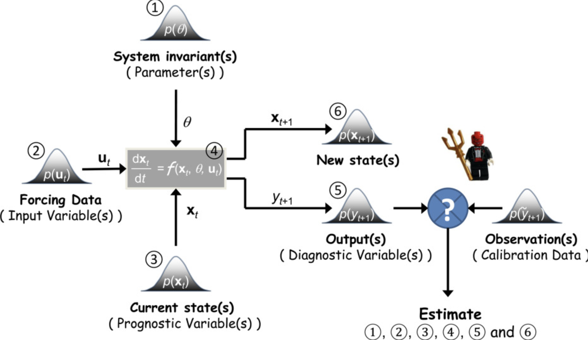
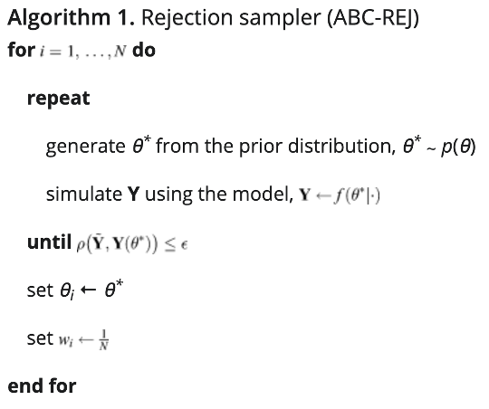
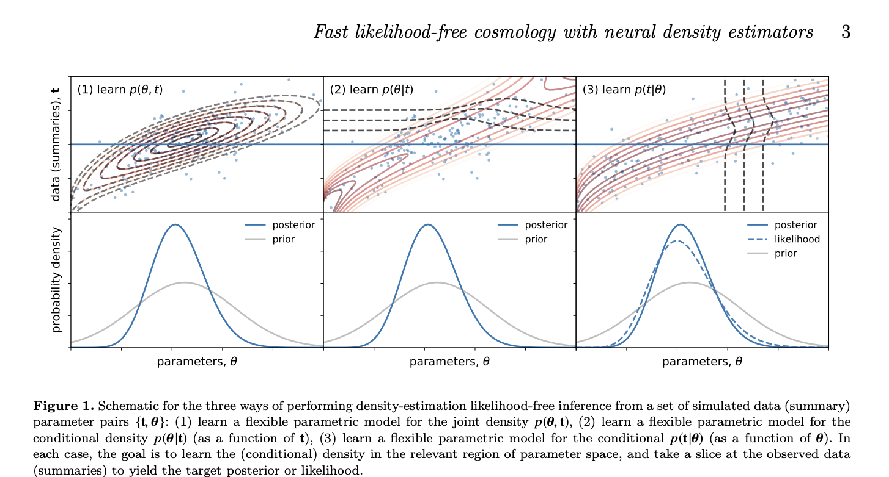
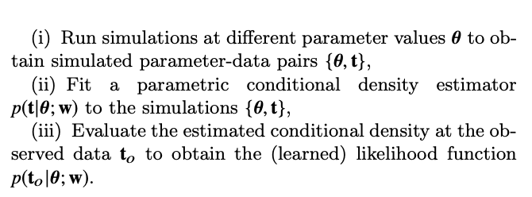

## Machine Learning References and Notes:

### Literature Review of SBI References in Hydrology and Beyond.
1. Forecasting: Principles and Practice
  - Hyndman and Athanasopoulos
  - A great reference for forecasting statistics:
  - https://otexts.com/fpp2/

2. The frontier of simulation-based inference - https://www.pnas.org/content/117/48/30055
  * Cranmer et al
  * Abstract:
    * Many domains have developed complex simulations to describe phenomena of interest
    * These high-fidelity models however are bad at inference and lead to challenging inverse problems
    * Enter simulation-based inference
  * Introduction:
    * Although simulations are cool, they are poorly suited for statistical inference
    * The source of this challenge is that the probability density (or likelhiood) for a given observation is usually intractable
      * QH Comment - This is the tension between generative and predictive models, no?
    * The problem of statistical inference has been dubbed 'likelihood-free inference', however this paper uses the term 'simulation-based inference' instead
    * Two main approaches have been hatched to to overcome the challenges of simulation-based inference:
      * 1. Creation of summary statistics and density estimation methods are used to approximate their distribution.
        * QH Comment - Equivalent to KGE and looking at distribution?
      * 2. Approximate Bayesian Computation (ABC) - compares the observed and simulated data based on some distance measure involving summary statistics
    * Three new forces:
      1. ML and simulation-based inference cross-pollination
      2. Active Learning - the idea of continuously using acquired knowledge to guide simulator
      3. Stop treating simulator as black box and focus on learning the internal details of simulator
  * Simulation-based Inference
    * Simulators
      * A simulator defines a statistical model
        * A simulator is a program that takes a vector of parameters (theta) as input
          * describe underlying mechanistic model
          * interpretable by a domain scientist
          * fixed dimensionality
          * E.G. hydraulic conductivity
        * samples a series of internal states or latent variables (zi ~ pi(zi|theta, z<i))
          * these latent variables may correspond directly or indirectly to a physically meaningful state of a system, however this state is often unobservable in practice
          * In practice this latent space may be accessible or inaccessible, and vary substantially.
        * produces a data vector x ~ p(x|theta, z) as output.
          * these data correspond to observations
      * An example of a simulator is a probablstic program, wherein random samples are taken
    * There is not a one-size-fits-all inference method
  * Inference:
    * Inference tasks differ by what is being inferred
      * Given 'x', is goal to infer input parameter theta? Latant variables 'z'? Both?
      * Inference may be performed with either a frequentist or Bayesian approach. Whether we are interested in calculating a posterior, we need the likelihood function p(x|theta).
        * However the likelihood is an intractable thing to solve for, because in order to find it we must take an integral of all probabilities within latent spaces that can be very large.
      * This paper reviews ways to calculate posteriors without calculating the likelihood.
      * These methods are a specialization of inverse uncertainty quantification (UQ) of model parameters in situations with accurate, stochastic simulators
        * We can think of observations as single obsevations or multiple i.i.d. In the case of a time series, we often think of it as a a single high-dimensional observations.
    * Traditional Methods:
      * ABC -> In the simplest form of rejection ABC, the parameters θ are drawn from the prior, the simulator is run with those values to sample xsim∼p(⋅|θ), and θ is retained as the posterior sample if the simulated data are sufficiently close to the observed data. In essence, the likelihood is approximated by the probability that the condition ρ(xsim,xobs)<ϵ is satisfied, where ρ is some distance measure and ϵ is a tolerance.
        * Within the limit epsilon approaches zero, inference with aBC becomes exact, but for continuous data the acceptance probability vanishes. In practice, small values of epsilon require unfeasibly many simulations. For large epsilon, sample efficiency is increased at the expense of inference quality.
        * ABC is best suited for the case of a single observation or a few i.i.d. observations.
          See 1A
      * Creating a model for likelihood by estimating the distribution of simulated data with histograms or kernal density estimation.
        * Apprxoimate Frequentist Computation
          See 1E
        * It is amortized - after upfront costs in computation at simulation and density estimation stage, new data opints can be evaluated efficiently.
          A good method for problems with many observations
      * Both traditional data suffer from the curse of dimensionality. The number of simulations increases exponentially with the dimension of the data x. Tehrefore both rely on low-dimensional summary statistics
      * Therefore, both simulations rely on low-dimensional summary statistics (which are the task of the domain expert)
    * Frontiers of Simulation-Based Inference:
      * Shortcomings:
        * Sample efficiency - number of simulated samples is prohibitively expensive
        * Quality of inference - the reduction of data to low-dimensional summary statistics discards some information of value, resulting in loss of statistical power
        * Amortization - Performing inference for new observed data requires repeating most steps of inference chain, in particular if the proposal distribution depends on observed data.
      * Opportunities:
        * 1. ML revolution allows us to work with high-dimensional data
          * e.g. Density estimation of high dimensions (estimate p(x) from x, without labels)
            * e.g. normalizing flows - variables described by simple base distribution are transformed to something with a tractable Jacobian
              * can also be used to generate data from hidden variables
          * e.g. Generative Adversarial networks - not restricted to be invertible.
        * 2. active learning can systematically improve sample efficiency (supervised-unsupervised learning technique)
          * the simple idea is to run the simulator at parameter points theta that are expected to increase our knowledge the most.
          * this can be done iteratively such that after each simulation the knowledge resulting from all previous runs is used to guide which parameter point should be used next.
            * E.G. Bayesian setting, where the posterior can be continuously updated and used to steer the proposal distribution of simulator parameters. But it applies equally well to efficiently calculating frequentist confidence sets
            * Similar ideas are discussed in the context of decision making, experimental design, and reinforcement learning, and we expect further improvements in inference algorithms from the cross-pollination of these fields.
            * Reinforcement Learning
            * Bayesian Optimization
            * How to make use of multi-fidelity simulators offering multiple levels of precision or approximations
        * 3. The deep integration of automatic differentiation and probabilistic programming into simulation code, as well as augmentation of training data with information that can be extracted from the simulator, is changing the way the simulator is treated. It is no longer a black box.
          * The previously described methods still treat the simulator as a black box.
          * This third way is to open the black box and integrate inference and simulation more tightly
          * Additional information that characterizes the latent data-generating process can be extracted from the simulator and used to augment the data used to train surrogates.
          * think about what other values could be used to supplement the model
          * These need to be calculated by taking derivatives and put into the deep neural network architecture
  * Workflows for Simulation-Based-Inference:
    * Possible Workflows:
      * Yellow - the integral simulator method
      * White Box - Proposal - the parameters at which the simulator is run, which are drawn from som distribution that may or may not depend upon the prior. And can be chose statically or iteratively with an active learning method.
      * Output - (white diamond) potentially high dimensional or redused to a low-dimensional summary statistic
      * Inference Method - two types: 1) use the simulator itself during inference and 2) constructs a surrogate model that is used for inference
        * In case (2), the green box is an unsupervised / supervised ML learning process that results in a surrogate model that is used for inference
    * Using the simulator directly during inference:
      * Vanilla ABC suffers from the fact that parameter points could come from a large mass of regions that are in strong disagreement with observed data.
        * One improvement is to run the algorithm directly from points that are expected to improve the knowledge of the posterior
          * however, this still leaves us with needing to choose summary statistics, distance measure, and tolerance
        * Another improvement (if the simulator is 'tractable' or 'differentiable'), asymptotically exact Bayesian inference is possible without relying on a distance tolerance or summary statistics
      * The probabilistic Paradigm presents a fundamental change to ABC.
        * First, it requires a simulator to be written in probabilistic language.
        * Second, it actually uses the latent variables to make the simulation more likely to match observed data and improve sample efficiency.
          * This allows us to infer the entire latent process
    * Surrogate Models
      * Lack of amortization is a problem with using the simulator directly. When new data come available, the whole chain is broken and needs to be repeated.
      * Enter, a surrogate model. This is particularly well for data consisting of many i.i.d. observations.
      * Train a neural conditional density estimator can learn i) the posterior or ii) the likelihood.
    * Neural networks can be trained to learn likelihood-ratio functions, where in the latter case the denominator is given by a marginal model integrated over a proposal or a prior.  
      * This is like using a GAN
      * often called the likelihood-ratio trick
    * This is cool because
  * Further reading:
    - the internal state of a simulator and what it means!
    - More about ABC
    - What is active learning?
      - https://en.wikipedia.org/wiki/Active_learning_(machine_learning)
      - Active Learning is a special case of machine learning in which learning algorithms can interactively query a user (or other information source) to label new data points with the desired outputs.
    - What is the difference between Bayesian and Frequentist Confidence Sets

3. Signature-Domain Calibration of Hydrological Models using Approximate Bayesian Computation: Empirical Analysis of Fundamental Properties:
  https://agupubs.onlinelibrary.wiley.com/doi/full/10.1002/2017WR021616#wrcr23213-bib-0065
  - Abstract
    - Investigate Signature-Domain inference of hydrological models using Approximate Bayesian Computation (ABC) algorithms
    - Comparison to 'traditional' time domain inference
    - Focus: quantificaiton of predictive uncertainty in streamflow time series and on understanding the information content of particular combinations of signatures
    - Results:
      - General Consistency of signature and time-domain inferences
      - Ability to estimate streamflow error model parameters (reliably quantify streamflow uncertainty) even when calibrating to signiture domains
      - The potential robustness of signature-domain inference when (probabilistic) hydrological model is mispecified
      - Limitations of signature-domain approach due to information loss when non-sufficeint statistics are used.
      - Flashiness Index is a good predictor of streamflow error parameters
  - Introduction:
    - In hydrological models, parameters need to be estimated via Calibration
    - Model Calibration Goal (often) in catchment-scale hydrological modeling: to find closest match between simulated and observed catch-ment responses.
    - Commonly, the goal is to compare observed and simulated time series directly (time domain)
    - Alternative - compare 'signatures' of observed and simulated time series
      Use Case 1: Data-Poor settings
      Use Case 2: Emphasize or DeEmphasize fitting of specific hydrograph features
    - Downsides of signature domain calibration:
      * Loss of information, which can have a negative impact on parameter estimates and prediction
      * Finding an 'adequate' signature is problem and domain specific and may be a time-intensive process in its own right.
      * Even when calibrating in the signature domain, the goal is seldom to predict the signatures themselves.
        * Rather, the goal is usually to predict underlying variables
        * And the associated predictive uncertainty.
    * Previous studies have shown that calibrating to streamflow signatures can result in reasonable simulations of streamflow time series. But what about the uncertainty in these simulated time series?
    * Goal:
      * infer parameters of hydrological models and residual error models
      * produce reliable predictive distributions of streamflow time series
      * platform for comparing information content of different signatures.
    * Scenario 1:
      * The hydrological model is assumed to provide a correct description of the data.
      * This serves as a chance to compare signature and time-domain inferences.
    * Scenario 2:
      * The model does not fully describe the dataset
      * i.e. nonsufficient signatures may be used to improve inference in the time domain
    * Objectives:
      * 1. How does the correspondence between inferences in the signature vs time domain depend on the number and type of signatures?
      * 2. How does data length affect the inference in the signature domain?
      * 3. Are there cases where signature domain calibration produces better results than time domain calibration?
      * 4. Is there a major difference in computational costs of signature domain vs time domain inferences using standard MCMC algorithms?
      * 5. Are signatures based on the FDC alone sufficient to constrain streamflow predictions?
    * 2.1 Bayesian Inference Fraemwork
    * 2.2 Description of Predictive Uncertainty in Streamflow Space
      * Formulating probabilistic model Q(theta, x) requires describing uncertainties involved in streamflow modeling process.
      * This study uses a traditional formulation where a deterministic hydrological model is supplemented with a random residual error model to describe the total effect of all sources of error.
      * Other approaches to assess uncertainties could be considered (i.e. using terms internal to model structure)
      * Review this section
    * 2.3 Hydrological Signatures
      * Quantiles
      * The 'entire' FDC   
      * Base Flow Index
      * Flashiness Index
    * 2.4 Implmentation of Signature-Domain Inference
      * Signature-domain inference is defined as the calibration of the probabilistic model Q(theta, x) to the streamflow signatures 'g'. For this, deriving the posterior and the likelihood is impossible. i.e. no cloased form
      * But sampling from the random function g(Q(thetat, x)) is relatively straightforward. This situation is well suited to sampling the posterior using an ABC approach.
      * 2.4.1 - ABC Distance Metric
        * ABC algorithm - Use SABC algorithm, which has two enhancements:
          * sampling theta values in step 1 from Markov chain
          * tightening ABC tolerance as the sampling progresses.
      * 2.4.2 ABC Distance Metric
    * 2.5 Implmentation of Time-Domain Inference
      * Using the probabilistic model Q(theta, x), the likelihood function for time-domain inference is readily available in closed form and fast to evaluate once the deterministic hydrological model has been computed. Hence, it is based on constructing the posterior p(theta:q, x) in closed form and exploring the posterior using a combination of optimization and MCMC sampling.
      * 2.5.1 Likelihood function
        * Note that it can only be used when using the whole time series
      * 2.5.2 Parameter Optimization and Sampling Algorithms
        * Very confusing!
    * 2.6 Generating Predicting Distributions
  - Questions:
    - What is the signature domain?
    - How do we quantify streamflow uncertainty? (i.e. estimate streamflow error model parameters)
    - What is the flashiness index?
    - What are some common signatures we use?
      - quantiles of streamflow distribution (ie values of flow duration curve)
      - base flow Index
      - flashiness Index
      - others
  * Further Reading
    - Read Kavetski et al (2018) an dWesterberg and McMillan (2015) for more information

4. Simulation, Bayes, and Bootstrap in Statistical hydrology
  * https://agupubs.onlinelibrary.wiley.com/doi/pdf/10.1029/96WR03355
  * Fortin et al 1997
  * Abstract
    * Statistical simulation from a Bayesian Perspective.
    * Inherent difficulties of parametric simulation (based on a parent distribution) and classical non-parametric simulation (based on bootstrap) are discussed
    * Alternative: nonparametric Bayesian Simulation Methodology (Polya resampling) is introduced)
      * simulating from a non-parametric predictive distribution from the analysis of a reference sample
        * equivalent to a bootstrap
    * Demonstrate how to assess the influence of a distribution hypothesis on simulation results
  * Introduction:
    * The proposed method (Polya resampling) consists in drawing observations from replacement from a reference sample. Can be applied to binomial, multinomial, and finally non-parametric settings.

5. Simulation based inference in computationally intensive inverse Problems
  * http://www.ipam.ucla.edu/abstract/?tid=3571&pcode=AIP2003
  * Higdon et al 2020
  * Abstract:
    * A typical setup for many inverse problems is that one wishes to update beliefs about a spatically dependent set of inputs (x) given rather indirect observations of y. Here, the inputs and observed outputs are related by complex physical relationships y = N(x) + e.
    * We consider applications where the physical relationship N(x) can be well approximated by a detailed simulation code M(x).
    * When the forward simulation code M(x) is sufficiently fast, Bayesian inference can be carried out via MCMC. Difficulties:
      * Although code may represent physical process, many unknwon inputs that need to be calibrated to the  meaured data
      * computational burden of fastest available forward simulators is often too large, so there is a need to speed up MCMC calculations
    * Talk:
      * Specify effective low-dimensional representations of inputs 'x' along with MCMC approaches for sampling the posterior distribution.
      * Specifically, augment the basic formulation with fast (possibly coarsened) formulations to improve MCMC performance
      * Can be very easily implemented in a parallel computing environment

6. An Approximate Likelihood Perspective on ABC Methods
  * Karabatsos et al, 2017.
  * https://arxiv.org/pdf/1708.05341.pdf
  * Abstract:
    * Bayesian Statistics offers a flexible modeling approach which can desribe the complexity of datasets
    * Summary article of ABC methods
  * Introduction:
    * The posterior is the maind object in Bayesian Statistics, and it is the result of the combination of two information sources - the prior distribution (which reflect extra experimental knowledge) and the likelihood functions, which formalizes the information provided by the data through the use of a given statistcial model.
    * Monte Carlo methods provide an opportunity to estimate samples from the posterior distribution.
    * Variational Optimization Methods can be applied to find a tractable density function, too
    * However, in the era of big data MCMC or VI may be too slow.
    * ABC has an alternative
  * Further Reading:
    * Nott, D. J., Fan, Y., Marshall, L. and Sisson, S. A. (2014). Approximate Bayesian Computation and Bayes linear analysis: Toward HighDimensional ABC. Journal of Computational and Graphical Statistics 23 65-86.
    * Vrugt, J. A. and Sadegh, M. (2013). Toward diagnostic model calibration and evaluation: Approximate Bayesian Computation. Water Resources Research 49 4335-4345.

7. Towards Diagnostic Model Calibration and Evaluation: Approximate Bayesian Computation.
  * https://agupubs.onlinelibrary.wiley.com/doi/full/10.1002/wrcr.20354
  * Vrugt et al 2013
  * Abstract:
    * The ever increasing pace of computational ower, along with continued advances in measurement technologies and improvements in porcess understanding, has stimulated the development of increasingly complex hydrologic models that simulate tons of stuff...
    * Reconciling these high-order system models with larger and larger volumes of field data is becoming difficult, because classical likelihood-based fitting methods lack the power to detect and pinpoint deficiencies in the model structure
    * Gupta et al propose steps (amongst others) toward the development of a more robust and powerful method of model evaluation.
    * This approach uses signature behaviors and patterns observed in the input-output data to illuminate the degree to which a representation of the real world has been adequately achieved, and how the model could be improved for the purpose of learning and scientific discovery. (but what about stakeholder interest?)
    * ABC as a vehicle for diagnostic model evalution.
      * This model relaxes the need for an explicit likelihood function in favor of one or several summary statistics rooted in hydrologic theory that together have a clearer and more compelling diagnostic power than some average of the error risiduals.
      * Two illustrative case studies
  
  * Introduction:
    * Much effort has gone into fitting hydrologic models to calibration data. focuses:
      * 1. Development of specialized objective functions that appropriately represent and summarize errors between predictions and observations
      * 2. Search for efficient optimization of algorithms that can reliably solve hydrological model calibration problems
      * 3. Determination of appropriate quantity and most informative kind of data
      * 4. Selection of an appropriate numerical solver for the partially structure differential and alebraic equation systems of hydrologic models
      * 5. Representation of uncertainty
      * 6. Development of methods inferring and refining mathematical structure and process equations in process based hydrological models
    * This body of research capitalizes on  the 'classical' error residual aggregation approach of Gauss. However, this approach has seen to be faulty because its lack of treatment of model structural and forcing data errors.
    * So, some approaches have arisen to address this limitation, particularly in the context of addressing model parameter and prediction uncertainty.
      * Many of these approaches adopt a Bayesian viewpoint, and relax the assumption of a single 'optimum' parameter value in favor of a posterior distribution that accurately recognizes the role of model structural, forcing data, calibration data, and parameter uncertainty.
    * Within the context of estimating parameter uncertainty, much debate has gone into selection of an estimate of the likelihood function p(Y|theta) in the Bayesian framework. However, it is increasingly recognized that “while this approach works for simple (low order) models and allows for the treatment of some uncertainty, it is fundamentally weak by design (a) it fails to exploit the interesting information in the data, and (b) it fails to relate the information to characteristics of the model in a diagnostic manner [Gupta et al., 2008]
    * Diagnostic (behavior) signature can give more clear and compelling evidence of structural model deficiencies and fit well into a Bayesian framework. Enter Approximate Bayesian Computaiton (ABC) as a possible vehicle for diagnostic model evaluation and uncertainty quantification.
    
  * See text for some important applications and interpretation of this method!
  * Further Reading:
    * Gupta et al 2008 - steps

8. Fast likelihood-free cosmology with neural density estimators and active learning
  * https://arxiv.org/abs/1903.00007
  * Alsang Charnock. Feeney. Men
  * Abstract:
    * Likelhihood-free inference provides a framework for performing rigorous Bayesian inference using only forward simulations.
    * The key challenge - developing methods that can achieve high-fidelity posterior inference with as few simulations as possible.
    * Enter Density-Estimation Likelihood-free inference (DELFI)
      * Turn inference into a density estimation task on a set of simulated data-parameter pairs
      * Order of magnitudes improvements over ABC
    * This paper uses Neural Density Estimators (NDEs) to learn the likelihood function from a set of simulated datasets
      * Active learning is used to adaptively acquire simulations in the most relevant regions of parameter space on-the-fly.
    * High-Fidelity posterior inference can be achieve with 10^3 simulations or fewer.
    * Advantages:
      * simulation-based inference
      * for simple problems where likelihood is known, DELFI offers a fast alternative to MCMC sampling
    * DELFI with NDEs and active learning PYDELFI.
  * Introduction:
    * Likelihood-free inference (LFI) is a new paradigm for performing Bayesian inference under very complex generative models (i.e. can only do forward simulations)
    * Challenge - developing a method that gives high-fidelity posterior inference from a feasibly small number of forward simulations.
    * Conventionally - this has been the purview of Approximate Bayesian Computation (ABC)
      * Usually requires too vast a number of forward simulations.
    * Density Estimation Likelihood-Free Inference aims to train a flexible density estimator for the target posterior from a set of simulated data-parameter pairs, and yield high-fidelity posterior inference from orders-of-magnitude fewer simulations than traditional ABC-based meethods.
    * Structure:
      * 2 - review density estimation likelihood free inference
      * 3 - review data compression schemes to accelerate likelihood-free inference
      * 4 - PYDELFI
      * 5-7 - Validate and Demonstrate the performance of PYDELFI .
  * 2 - Density Estimation Likelihood-Free Inference
    * Density estimation from parameter-data (summary) pairs.
    * Three main approaches:
      1. Fit model to joint density -> obtain posterior by evaluating joint density at observed data t_0
      2. Fit model to conditional density p(theta|t) -> obtain posterior by evaluating at observed data t_0
      3. Fit model to conditional density p(t|theta) -> obtain likelhiood and multiply by prior to get posterior
    * Option 3 (which requires learning the likelihood) results in a more stable model, and makes it easier to explore different prior assumptions without re-weighting issues. Additionally, compressing information to summary statistics can make density estimation relatively simple
      
    * Algorithm
      
    * Three Questions that must be asked:
      * How do we parameterize conditional density estimator in a sensible way
      * How do we run simulations in the most relevant parts of parameter space for the ultimate target to best use available resources
      * How do we compress data vector d to an effective summary statistics
    * 2.2 NDEs (Neural Density Estimators)
      * NDES provide flexible parameteric models for conditional probability densities, parameterized by neural networks with weights 'w' which can be trained on a set of simulated data-parameter pairs
        * Mixture Density Networks (MDNs)
          * a class of models for conditional density for estimating p(t|theta; w)
          * a mixture density network of p(t|theta) with a single gaussian component defines a gaussian likelihood - a common approximation used in many cosmological data analysis problems. This is better!
        * Maksed Autoregressive Flows (MAFs)
          * MADE _+
    * 2.2.3 Training Neural Density Estimators
      * find the weights of the neural network that minimize the Kullback-Leibler divergence between parametric density and target p(t:theta)
    * 2.3 Bayesian Networks, Deep Ensembles, Stacked Density Estimators
      * Some simple sophistications can improve robustness
      * Training ensembles of NDES allows for straightforward estimation of the uncertainty of learned likelihood.
        * cheaper and simpler than inferring  a bayesian context
      * Or train networks in a Bayesian context, inferring posterior distribution for network weights given training data. -> regularize the networks over the prior.
        * allow for the control of regularization in an interpretable way.
    * 2.4 adaptive Aquisition of Simulations with Active Learning
      * Goal - achieve highest fidelity posterior inference with fewest simulations
      * Need - preferentially run simulations in the most interesting regions of parameter space, which are not known a priori.
      * Active learning allows the neural density estimators to call the simulator independently during training, automatically deciding on the fly where the best parameters to run new simulations are based on their current state of knowledge / ignorance of the target posterior.
      * 2.4.1 Active Learning with Sequential Neural LIkelihood (SNL)
        * runs simulations in series of batches, where parameters for each new batch are drawn from proposal density based on current posterior approximation.
        * NDEs are re-trained after each new simulation batch.
        * This way, the algorithm adaptively learns the most relevant parts of the parameter space to run new simulations improve ongoing posterior iference
        * How to define optimal proposal density is an open question
          * based on last posterior?
          * geometric mean?
      * Active Learning with Bayesian Optimization
         * the next simulation is run at the parameters that maximize some deterministic acquisition function that encodes a tradeoff between releavnce and uncertainty
          * Need Two ingrediaents:
            1. quantification of uncertainty in learned posterior surface
            2. carefully chosen acquisition rule
      * For '1', using an ensemlbe of NDEs provides uncertainty
      * For '2', it (optimal acquisition rule) is a bit harder.
        * simple - the current variance of the estimated posterior density
        * minimize the expected integrated variance of the approximate posterior under a new simulation draw.
        * This is an ongoing area of research
    * 2.5 Global vs local emulators
      * For parameter inference tasks where the data is already observed, the target is the likelihood function p(d{obs}|theta).
      * However, for others we may run many experiements that generate independent realizations of 'd' from the same data generating process, and we want to analyze those data as they are taken.
        * Here we can use a 'global emulator' for p(d|theta) over the full prior volume that can then be used to analyze any subsequent data 'd' as they are observed.
          * QH NOTE - I think this is what we are doing in our research?
  * 3 - Data Compression
    *  Data Compression Need depends on the size of the data vector relative to the number of simulations that can feasibly be performed (given that one needs enough simulations to learn the sampling distribution of the data - summaries - as a function of the parameters).
    * Compressing 'N' data down to 'p' summaries (one per parameter)
      * approximate score-compression
      * data compression with deep neural networks
    * 3.1 Approximate Score-Compression
      * For Gaussian Data where the model depends on parameters either through the mean or covariance, it is equivalent to MOPD or optimal quadratic estimator
      * One can approximate compression using an approximate likelihood
      * One can learn conditional desnity p(d|theta) from simulations
      * One can regress the score-function directly from simulations in a likelihood-free manner using neural networks.
    * 3.1.1 Nuisance hardened approximate score-compression
    * 3.2 Deep Neural Network Data Compression and Information Maximizing Networks
      * Find cosmological parameter estimators from complex data sets by training deep neural networks to regress parameters from data simulations
      * Straightforward, but require many simulations.
    * 3.3 Considerations for Cosmological Data Analysis: Two-Step Data Compression
    * 4 PYDELFI
      * 4.1 Overview:
        1. Specify Architecture
        2. Specify simulator that takes in parameters and returns data vector
        3. Compress data vector
        4. Run PYDELFI active learning lmethods to learn the likelihood function (then used to calculate the posterior)
        * (Or if a suite of simulations has been run beforehand), then feed straight into PYDELFI and NDES without exploiting active learning...
      * 4.2 Neural Network Implementation and Training:
  * Further Reading:
    * Alsing et al 2018b
    * Papamakarios & Murray 2016
    * Papmamakarios et al 2018

9. Signature-Domain Calibration of Hydrological Models Using Approximate Bayesian Computation: Theory and Comparison to Existing Applications
  * Kavetski et al 2018
  * Partner paper for Fenicia et al going over the theory of ABC

10. Chapter 3 - Learning in Parametric Modeling: Basic Concepts and Directions
  * https://www.sciencedirect.com/science/article/pii/B978012818803300012X
  * Theodoridis et al
  * Good reference Text
  * Abstract:
    * The present chapter presents an overview of basic directions in machine learning and the basic notions related to parametric modeling are introduced. The tasks of regression and classification are defined and basic concepts related to parameter estimation, such as estimator efficiency, Cramér–Rao bound, and sufficient statistic, are outlined. The least-squares estimator and some of its properties are discussed. The notions of inverse problems, overfitting, bias–variance dilemma, and regularization are presented. The methods of maximum likelihood, maximum a posteriori, and Bayesian inference are introduced. Finally, the curse of dimensionality and the cross-validation technique are provided. The chapter closes with a brief discussion and some formal definitions of notions such as expected loss and empirical risk functions and the interplay between approximation and estimation errors.

11. Inferring Coalescent Times from DNA sequence
  * Tavare et al 1997
  * First text to discuss ABC
  * https://www.ncbi.nlm.nih.gov/pmc/articles/PMC1207814/pdf/ge1452505.pdf

12. Massive optimal data compression and density estimation for scalable, likelihood-free inference in cosmology
  * Alsing et al 2018
  * A slightly more verbose version of Alsing 2019
  * https://arxiv.org/abs/1801.01497

13. Google Doc with Peter's Notes from 06/07
  * https://docs.google.com/document/d/1fDTu-kN__vuLPHKoR9d5wM_7P_uqq1C2DWcAXS83HYE/edit

14. Moder Statistics - Peter's Class
  * https://sml505.pmelchior.net/14-ApproximateInference.html#simulation-based-inference
  * sml505/principled

15. Streamflow Simulation in Data-Scarce Basins Using Bayesian and Physics-Informed Machine Learning Models
  * Lu et al 2021
  * Bayesian LSTM
  * https://journals.ametsoc.org/view/journals/hydr/aop/JHM-D-20-0082.1/JHM-D-20-0082.1.xml

### Further Reading:
  * Some further applictions of SBI and specifically DELFI in hydrology 
  * Alsing et al 2018b
  * Papamakarios & Murray 2016
  * Papmamakarios et al 2018
  * Gupta et al 2008 - steps
  * Nott, D. J., Fan, Y., Marshall, L. and Sisson, S. A. (2014). Approximate Bayesian Computation and Bayes linear analysis: Toward HighDimensional ABC. Journal of Computational and Graphical Statistics 23 65-86.
  * Vrugt, J. A. and Sadegh, M. (2013). Toward diagnostic model calibration and evaluation: Approximate Bayesian Computation. Water Resources Research 49 4335-4345.
  * Read Kavetski et al (2018) an dWesterberg and McMillan (2015) for more information about signature domain

### Questions
  * What is the difference between Bayesian and Frequentist Schools of Thoughts?
  * What is PEST, really, and how is it distinct from simulation-based-inference?
  * What is MCMC?
    * Overview:
      * Markov Chain Monte Carlo
      * https://en.wikipedia.org/wiki/Markov_chain_Monte_Carlo
      * Class of algorithms for sampling from probability distribution
      * Construct a Markov Chain that the desired distribution as its equilibrium distribution, one can obtain a sample of desired distribution by recording states from the chains.
      * More states, the more closely the distribution matches the actual desired distribution
    * Application Domains:
      * Typically used to compute large hierarchical models that require integrations over hundreds of thousands of unknown Parameters
      * In rare event sampling, they are also used for generating samples that gradually populate the rare failure regions
    * General Explanation:
      * MCMC create samples from continuous random variables with probability density proportional to a known function. Used to evaluate an integral over that variable, as an expected value
      * Ensemble of Chains are usually developed starting from a set of points arbitrarily chosen and sufficiently distant from each other. Move around randomly according to an alogrithm that looks for places with a high contribution to the integral to move into next.
      * Random walk Monte Carlo are a kind of random simulation. Whereas random samples in conventional MonteCarlo are independent, MCMC are autocorrelated. Correlations of samples introduces the need to utilize a Markov chain central limit theorem when estimating the error of mean values.
    * Example:
    * Software:
      * Python ParaMOnte
    * Machine Learning Mastery:
      * https://machinelearningmastery.com/markov-chain-monte-carlo-for-probability/
      * Probabilistic inference often involves estimateing an expected value or density using a probabilistic model
      * Directly inferring values is not always tractable with probabilistic models, so approximation must be used.
      * Markov Chain MoteCarlo sampling provides a class of algorithms for systematic random sampling from high-dimensional probability distributions. This method allows the algorithm to narrow in on the quantity that is being estimated by the distribution.
      * Details:
        * We are often interested in knowing the expected probability of an outcome, but the direct calculation of this value is often intractable.
        * So, we use some level of approximation
        * The desired calculation is typically a sum of discrete distribution of many random variables, or integral of a continuous distribution of many variables that is intractable to calculate.
        * Problem:
          * Bayesians need to integrate over the posterior distribution of model parameters given data
          * Frequentists need to integrate over the distribution of observables given parameter values
        * Solution:
          * Monte Carlo Sampling: Draw independent samples from probability distribution and repeat this process many times to approximate a desired quantity.
          * New Problem: curse of dimensionality and assumes independence
        * Markov Chain Monte carlo
          * For sampling probability distributions in high-dimensions
        * Assumptions:
          * Typically assume that we can efficiently draw samples from target distribution. We can then estimate the sum or integral quantity as the mean or variance of the drawn samples.
        * Example:
          * Consider a two-dimensional shape, like a spiral
          * We cannot easily define a function to describe the spiral, but we may be able to draw samples from the domain and determine if they are part of the spiral or not.
          * Together, a large number of samples drawn from the domain will allow us to summarize the shape (probability density) of the spiral.
  * How does simulation based inference help us to understand the uncertainty of our predictions?
  * Joint Density v Conditional Density
  * I'm a little confused about the difference between emulators in the context of p(d|theta) vs. our approach to emulation?
  * How do we compress time series data, which seems a bit distinct from (say) compressing a spectral analysis or something?
    * Approximate Score Compression
    * Data Compression with Deep Neural Networks
    * Expert Inference
  * What are independent and identically distributed variables (i.i.d.)
    * https://en.wikipedia.org/wiki/Independent_and_identically_distributed_random_variables#:~:text=In%20probability%20theory%20and%20statistics,i.i.d.%20or%20iid%20or%20IID.
    * A collection of random variables is i.i.d. if each random variable has the same probability distributions as all the others and is mutually independent. This is of course not true in reality, but a common assumption.
      * time-dependent series are usually not i.i.d. (but can we make this assumption?)
  * What is 'non-parametric simulation'?
    * Non-parametric methods, parameters may still be involved in establishing the input-output relationship, yet their number is not fixed. It depends on the size of the data set and it grows with the number of observations. Non-parametric methods will be treated but primarily this book discusses parametric models.
  * What is 'parametric simulation'?
    * https://www.sciencedirect.com/topics/engineering/parametric-modeling
    * Process that can change the shape of model geometry
    * Parametric modeling, functional dependence upon inputs and outputs is defined via a set of parameters (i.e., whose number is fixed and a-priori known). The value of the parameters are unknown and have to be estimated based on available input-output observations.
  * How to deal with the uncertainty imposed by unknown values of involved parameters?
    * 1. Parameters are treated as deterministic nonrandom variables
      * The task of learning is to obtain estimates of their unknown values. For each parameter a single value estimate is obtained
    * 2. Unknown parameters are treated as random variables, and the task of learning is to infer the associated probability distributions. Once the distributions have been learned / inferred, one can use them to make predictions.
  * What is active learning?
    - https://en.wikipedia.org/wiki/Active_learning_(machine_learning)
    - Active Learning is a special case of machine learning in which learning algorithms can interactively query a user (or other information source) to label new data points with the desired outputs.
